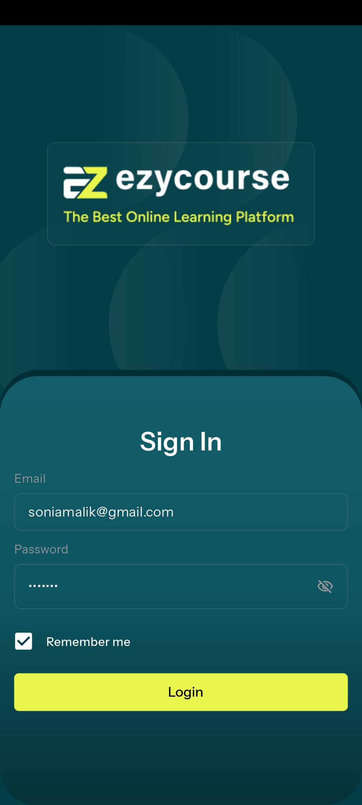
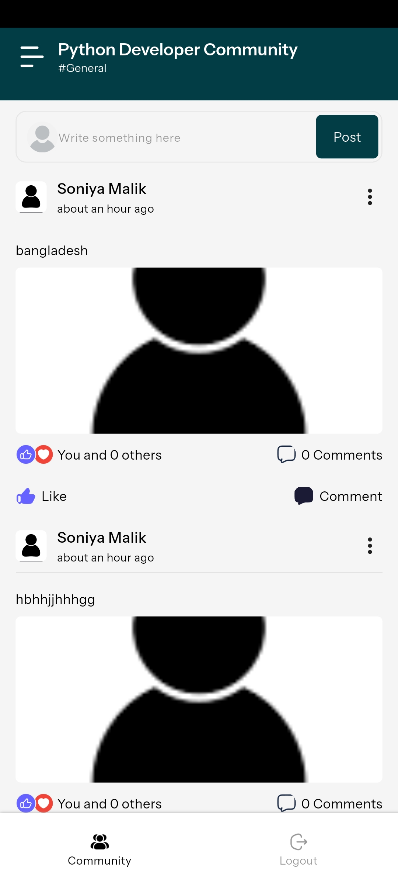
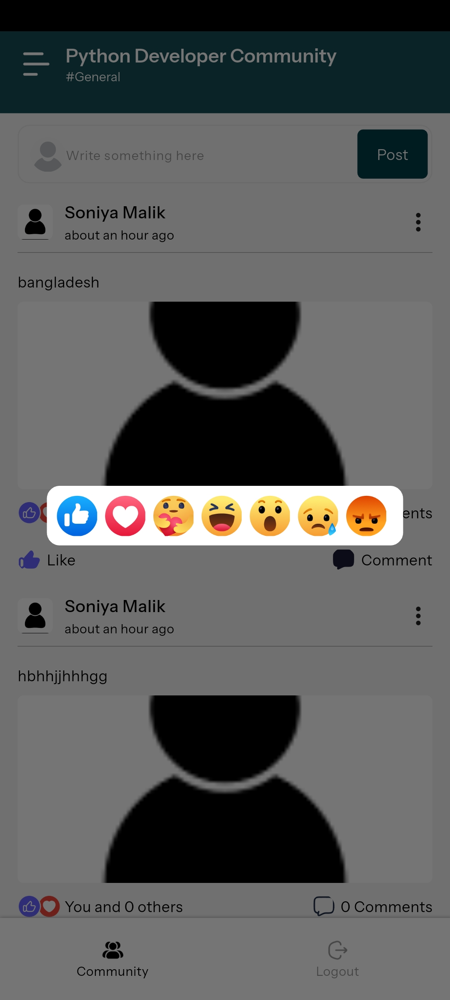
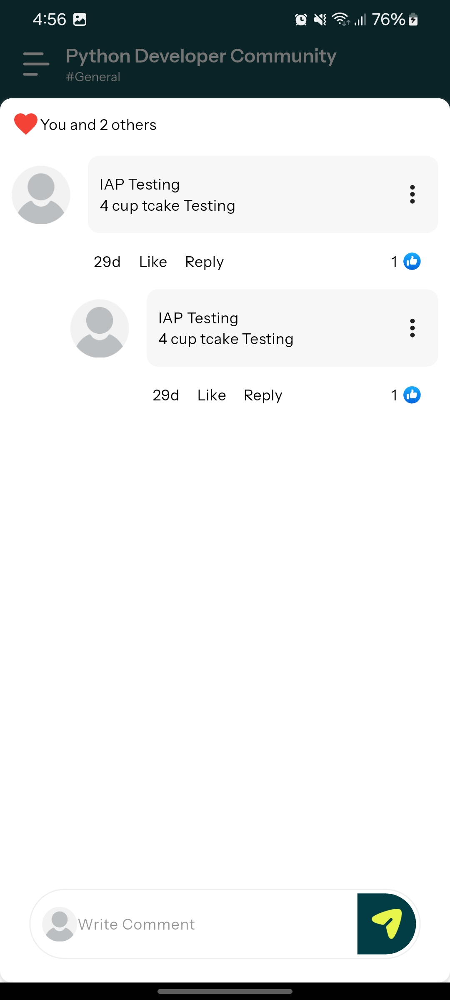
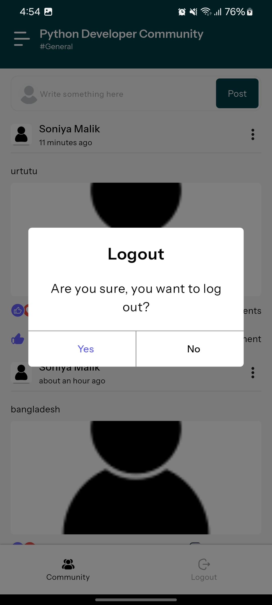

# Easy Course

## Getting Started
Welcome to **Easy Course**! This project is built using **Flutter version 3.7**. Follow the steps below to set up and run the project.

---

### How to Run This Project

1. **Open your IDE**  
   Use your preferred IDE, such as **Android Studio** or **Visual Studio Code**.

2. **Install Dependencies**  
   Run the following command to fetch all the required dependencies:
   ```bash
   flutter pub get

## Screenshots








## Download APK
[Download APK](https://drive.google.com/file/d/1T92Anxs645_Ritvx3a6_JmwpjDNNLxQ6/view?usp=sharing)